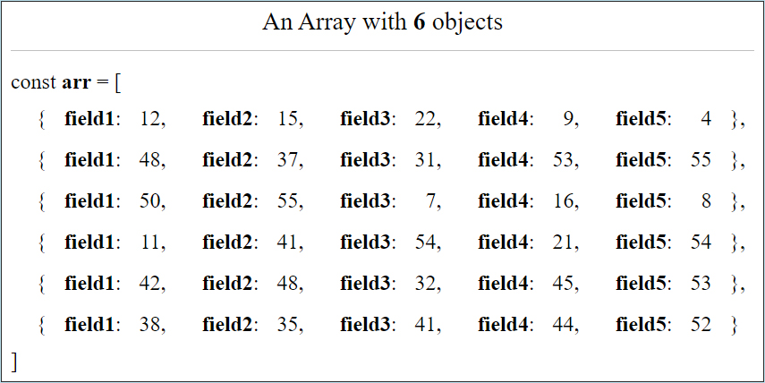
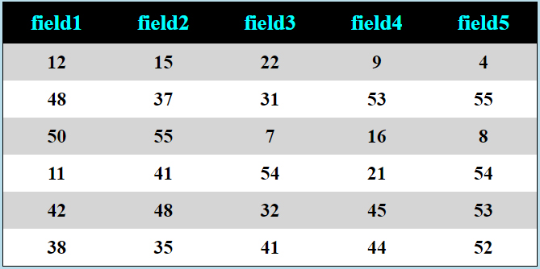
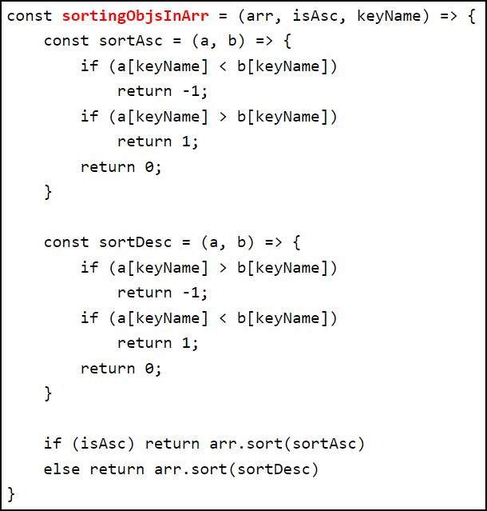

# Sorting Objects within an Array, by Field Name

If we have an array of objects like:

Which could be showed as a table:

This way of doing thing might be obvious to most of programmers, but it wasn't for me: to sort objects within an array, I've learned (here, it's ascending sorting):

    const sortAsc = (a, b) => {
		if(a.fieldName < b.fieldName)
			return -1
		if(a.fieldName > b.fieldName
			return 1
		return 0
	}

	const sortedArr = myArr.sort(sortAsc)

The "**fieldName**" is fixed and it could not be changed for another field name. I was building as much functions as the field names could have (I know, that's typically a problem for a beginner, but this could be helpful for students of the first year in Computer Science ;-))

To sort, 